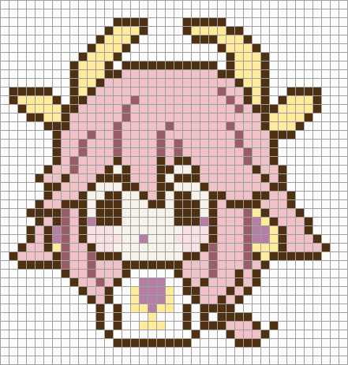
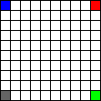
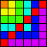

# Pixelar

Show everyone the art hidden inside your code 🧁



_Code for this piece of pixel art can be found [here](src\drawings\custom\chico.rs) (It's a copy of a picture on pin)._

## What

Pixelar is a package that provides you simple API to create pixel arts using rust code.

- The main purposes of this package is for **Learning purposes and turning the code to something visual** so it may become easier to understand.

- It can also be used for creating unique pixel arts and FUN.

### Dependencies

Pixelar uses [imageproc](https://github.com/image-rs/imageproc) and [image](https://github.com/image-rs/image) from [image-rs](https://github.com/image-rs) to create images.

## Get Started

To quickly get started with the package, just bring our prelude into the scope and create a `PixelPaper`.

``` rust
use pixelar::prelude::*;

fn main() {
    let mut pixel_paper = PixelPaper::<10, 10>::default();
}
```

Note that constant generic numbers on pixel paper ( `::<10, 10>` ). These're the height and width of your paper in pixels.

Here we have a 10*10 paper.

Now you can mutably access the pixels table on the paper and modify it.

``` rust
use pixelar::prelude::*;

fn main() {
    let mut pixel_paper = PixelPaper::<10, 10>::default();

    let table = pixel_paper.get_mut_table();
}
```

You're given a 10*10 2D array of `PixelDescriptor`.

A `PixelDescriptor`, describes a pixel at the specified position. It's a simple enum with only two variants:

``` rust
pub enum PixelDescriptor {
    Nothing, // Nothing there
    Pixel(Pixel), // A pixel with some color.
}
```

Now you can do whatever you want on the pixels.

``` rust
    // ---- sniff ----

    let red = PixelDescriptor::Pixel((255, 0, 0).into());
    let green = [0, 255, 0];
    let blue = (0, 0, 255);
    let gray = 100; // (100, 100, 100)

    table[0][0] = blue.into();
    table[0][9] = red;
    table[9][9] = green.into();
    table[9][0] = gray.into();
 
    // ---- sniff ----
```

You can turn anything that translates to an rgb code into a `PixelDescriptor` simply by calling `into` on it.

_All pixels are `PixelDescriptor::Nothing` by default.`_

Then finally save your art to a file.

``` rust
    // --- sniff ---

    pixel_paper.save("arts/simple_1.png").unwrap()
}
```

Run the code and check the result.



This was the whole idea! But there're more ...

``` rust
use pixelar::{colors::*, positions::*, prelude::*};

fn main() {
    let mut pixel_paper = PixelPaper::<6, 6>::default();

    let rainbow = [
        (250, 130, 0),
        (240, 250, 0),
        (60, 250, 0),
        (0, 250, 220),
        (0, 10, 250),
        (210, 0, 250),
    ];

    for i in 0..6 {
        for j in 0..6 {
            let choose = match j.cmp(&i) {
                std::cmp::Ordering::Less => i,
                std::cmp::Ordering::Equal => j,
                std::cmp::Ordering::Greater => j,
            };

            pixel_paper.change_pixel_color((i, j), rainbow[choose])
        }
    }

    pixel_paper.draw_straight_line(Red, RightTopEdge, LeftBottomEdge);

    pixel_paper.save("arts/simple_2.png").unwrap()
}
```

Here's the result:


